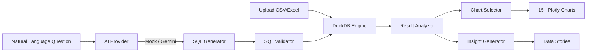

<div align="center">

# DataLens AI

**AI-Powered Data Analytics Agent**

*Upload your data. Ask questions in plain English. Get SQL, charts, and insights instantly.*

[](https://github.com/mekalaajayk/datalens-ai/actions/workflows/ci.yml)
[](https://www.python.org/downloads/)
[](LICENSE)
[](https://huggingface.co/spaces/mekalaajayk/datalens-ai)

</div>

---

## What is DataLens AI?

DataLens AI is an open-source data analytics agent that lets you **talk to your data**. Upload a CSV or Excel file, ask questions in natural language, and get:

- **SQL queries** generated automatically from your questions
- **15+ chart types** selected intelligently based on your data
- **Statistical insights** and data quality scoring
- **Data stories** — auto-generated narrative reports

**Zero API keys required** — works out of the box with a rule-based AI engine. Optionally add Google Gemini (free tier) for smarter queries.

## Architecture



## Features

| Feature | Description |
|---------|-------------|
| **NL-to-SQL** | Ask "What are the top 5 products by revenue?" and get instant SQL + results |
| **15+ Charts** | Bar, line, scatter, pie, heatmap, histogram, KPI, treemap, violin, and more |
| **Data Profiling** | Auto-detect types, quality scoring (0-100), correlation discovery |
| **DuckDB Engine** | Lightning-fast in-process OLAP — no database setup |
| **Demo Mode** | 4 built-in datasets, works with zero configuration |
| **Data Stories** | 5 story templates with multi-format export (HTML/PDF/MD/JSON/CSV) |
| **Conversational** | Follow-up questions with context memory |
| **CLI + Web** | Click CLI for terminal, Streamlit app for browser |

## Quick Start

### Install

```bash
pip install datalens-ai[streamlit]
```

### Run

```bash
# Streamlit app
streamlit run app/streamlit_app.py

# CLI demo
datalens demo

# Query a file
datalens query data.csv "What is the average salary by department?"
```

### Docker

```bash
docker compose up --build
# Open http://localhost:8501
```

## Sample Datasets

| Dataset | Rows | Description |
|---------|------|-------------|
| E-Commerce Orders | 3,000 | Products, categories, regions, revenue |
| World Climate | 600 | Temperature, rainfall, humidity for 10 cities |
| Stock Prices | 1,800 | Daily OHLCV data for 10 major stocks |
| HR Employees | 1,000 | Salary, performance, satisfaction, demographics |

## AI Providers

| Provider | Cost | API Key | Features |
|----------|------|---------|----------|
| **MockProvider** | Free | None | Pattern-matching NL-to-SQL (count, top N, avg, trend, distribution) |
| **GeminiProvider** | Free tier | `GEMINI_API_KEY` | Full NL-to-SQL with Google Gemini Flash (15 RPM) |

```bash
# Optional: enable Gemini
export GEMINI_API_KEY=your-free-key-here
```

## Project Structure

```
datalens-ai/
├── src/datalens_ai/
│   ├── core/           # Models, config, constants, registry
│   ├── ai/             # NL-to-SQL providers (Mock, Gemini)
│   ├── engine/         # DuckDB engine, SQL validator, result analyzer
│   ├── ingestion/      # File loader, profiler, quality scorer
│   ├── visualization/  # Chart factory, selector, theme
│   ├── stories/        # Data story builder, templates, export
│   ├── reporters/      # HTML, PDF, Markdown, JSON, CSV reporters
│   ├── utils/          # Text, SQL, caching, rate limiting utilities
│   └── cli.py          # Click CLI
├── app/
│   └── streamlit_app.py  # Streamlit web app
├── data/samples/       # 4 built-in sample datasets
├── tests/              # Unit + integration tests
├── docs/               # MkDocs Material site
└── docker-compose.yml
```

## Development

```bash
git clone https://github.com/mekalaajayk/datalens-ai.git
cd datalens-ai
pip install -e ".[all,dev]"

# Run tests
pytest tests/ -v

# Lint
ruff check src/ tests/
```

## Tech Stack

- **Python 3.10+** with Pydantic v2 domain models
- **DuckDB** — in-process OLAP SQL engine
- **Plotly** — interactive visualizations
- **Streamlit** — web application framework
- **Click** — CLI framework
- **Rich** — terminal formatting
- **scikit-learn** — data analysis utilities
- **Google Gemini** — AI-powered SQL generation (optional, free tier)

## License

MIT License. See [LICENSE](LICENSE).

## Author

**Mekala Ajay** — Data Analyst & AI Specialist

- GitHub: [@mekalaajayk](https://github.com/mekalaajayk)
- LinkedIn: [mekalaajayk](https://linkedin.com/in/mekalaajayk)
