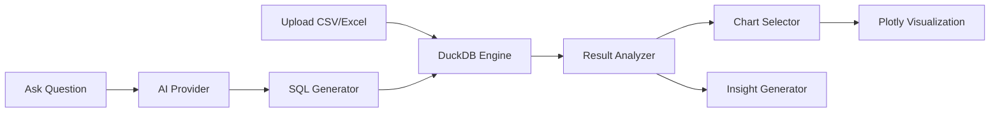

# DataLens AI

**AI-powered data analytics agent** — upload your data, ask questions in plain English, and get SQL queries, visualizations, and insights automatically.

## Features

- **Natural Language to SQL** — ask questions like "What are the top 5 products by revenue?" and get instant SQL + results
- **15+ Auto-Visualizations** — bar, line, scatter, pie, heatmap, histogram, KPI cards, and more
- **Smart Data Profiling** — automatic column detection, quality scoring, and relationship discovery
- **Zero-Config Analytics** — powered by DuckDB, no database setup required
- **Demo Mode** — works out of the box with 4 built-in sample datasets, no API keys needed
- **AI Providers** — Google Gemini (free tier) or rule-based MockProvider
- **Data Stories** — auto-generated narrative reports from your data
- **Export** — download results as HTML, PDF, Markdown, JSON, or CSV

## Quick Start

```bash
pip install datalens-ai[streamlit]
datalens demo
```

Or run the Streamlit app:

```bash
streamlit run app/streamlit_app.py
```

## Architecture



## Sample Datasets

| Dataset | Rows | Description |
|---------|------|-------------|
| E-Commerce Orders | 3,000 | Products, categories, regions, revenue |
| World Climate | 600 | Temperature, rainfall, humidity for 10 cities |
| Stock Prices | 1,800 | Daily OHLCV for 10 major stocks |
| HR Employees | 1,000 | Salary, performance, satisfaction data |
